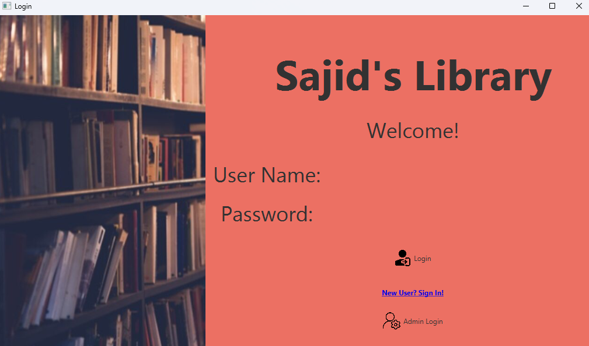
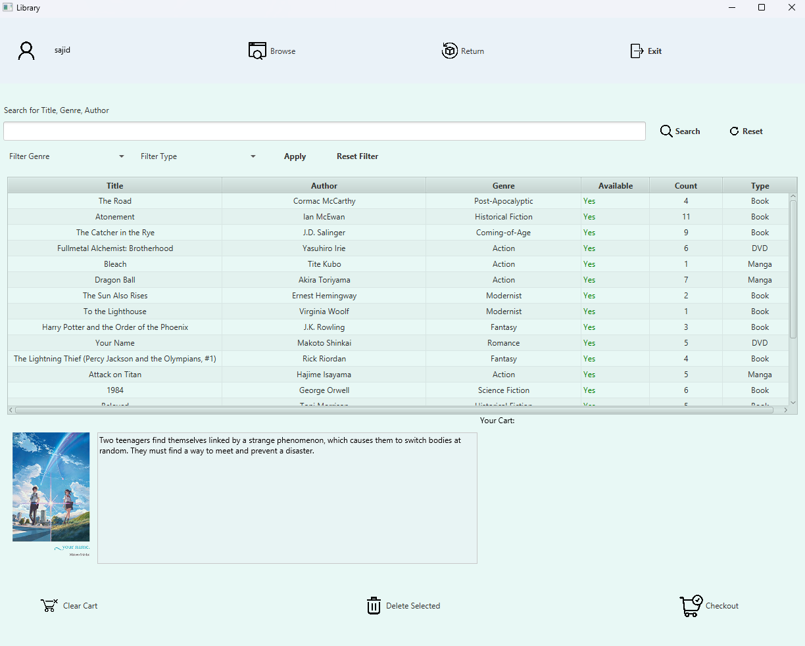
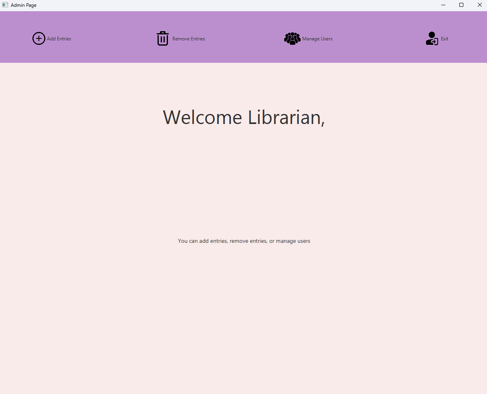

To download this repo run the following command or use the git features of your IDE.

git clone url_of_repo

    Commit as often as possible
    Write useful commit messages
    Every time you sit down to work run git pull to make sure you have your latest changes
    Every time you commit and whenever you are done working for the day run git push to make sure your changes are stored
    DO NOT remove or comment out parts of the gitignore. You may add to it.
    DO NOT use the GitHub website to make commits or modify files. If you are unable to use git locally please come to office hours
    DO NOT make branches, pull requests, or issues

# Login Page

# Library Access Page

# Administrator Page

# Documentation
- ## **How to run the server**

    - ### **Step 1:** Open your preferred terminal and input the following command to connect to my MicroSoft Azure server

        - #### `ssh ProjectUser@20.172.64.102`
    - ### **Step 2:** You will need to know the password to connect to the server. If you do not know the password, please contact me.

    - ### **Step 3:** Once you're connected to the server, input the following command to compile the server

        - #### `java -jar ServerSide.jar`

    - ### **Step 4:**  The server will now be running and waiting for a client to connect to it.
 
- ## **How to run the client**
  - ### **Step 1:** Locate the ClientSide.jar file in the ClientSide folder of the repo
    - #### `ClientSide/out/artifacts/ClientSide_jar/ClientSide.jar`

  - ### **Step 2:** Run the ClientSide.jar file by double clicking it or by running the following command in your terminal in the correct directory
    - #### `java -jar ClientSide.jar`
# ServerSide

#### My server side is structured to where I have a server class that handles all the connections and a client class that handles all the client side stuff. I have a main class that runs the server and a client class that runs the client.

#### I first start off with initializing my monogoDB database and putting all the information in a data structure for later use. I create a server object and start it. I wait for a client to be initialized. The client object is used to send messages to the server and the server object is used to send messages to the client. 

#### The server sends all the entries to the client so that when the client needs to display all the entries, it has the information.

#### One a user logs in, they need to input information to be let in to the libarary.

#### I made a login system where new and old users can come and log in to the library.

#### There are a lot of files used in the ServerSide. I have 3 different data structures that I need to keep track of and thats what Admin.java, Entry.java, and LoginInfo.java are.

#### My Server class is where the bulk work is happening, where I process requests from the ClientHandler.java class. This is also where I send messages back to the client.

#### My ClientHandler class is similar to the middle man between my Server and Client classes. When the ClientHandler reads a request from the client, it will parse any information it gets and send it to the Server for processing.

# ClientSide

#### Once the user opens the client, they are met with the login screen where they can login or register as a new user.
#### When the user logs in, they are free to browse the libarary of books, DVDs, and mangas. They can also search for a specific item by title, author, or genre and even filter entries. 
#### When the client presses a button that has to deal with checking out, logging in, registering, returning, exiting, it sends a message to the server in which the server handles the requested process
#### if the user is a librarian or administrator, they have a separate GUI where they have different functions such as adding entries, removing entries, and viewing all the users who have registered.
#### The ClientSide has may FXML and controller files for the different parts of the GUI. I have a controller for the login screen, the library screen, and the administrator screen. 
#### I also included pictures of all the entries for people to see what the library has to offer.

# Points I think I got
- #### **librarian with features - 4 pts**
- #### **register - 2 pts**
- #### **due dates - 1 pt**
- #### **Nice GUI - 5 pts**
- #### **Observable Class Implementation - 3 pts**
- #### **MongoDB backend - 4 pts**
- #### **Searching Entries - 2 pts**
- #### **Filter Entries - 2 pts**
- #### **Images - 2 pts**
- #### **Checks for multiple of the same users - 2 pts**
- #### **MS Azure backend - 5 pts**

